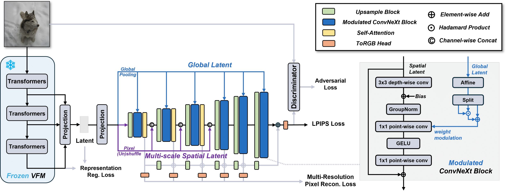
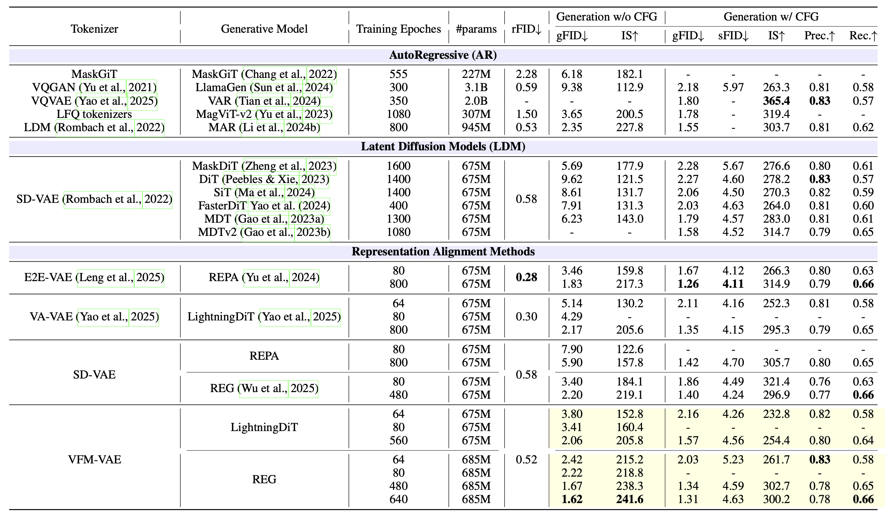

<div align="center">

<h1>Vision Foundation Models Can Be Good Tokenizers <br> for Latent Diffusion Models</h1>

<p>
  <a href="https://github.com/tianciB">Tianci Bi</a><sup>1</sup>&emsp;
  <a href="https://www.microsoft.com/en-us/research/people/xiaoyizhang/">Xiaoyi Zhang</a><sup>2</sup>&emsp;
  <a href="https://www.microsoft.com/en-us/research/people/yanlu/">Yan Lu</a><sup>2</sup>&emsp;
  <a href="https://iair.xjtu.edu.cn/info/1046/1229.htm">Nanning Zheng</a><sup>1</sup>
</p>

<p>
  <sup>1</sup> Institute of Artificial Intelligence and Robotics, Xi'an Jiaotong University<br>
  <sup>2</sup> Microsoft Research Asia
</p>

<p>
  📧 Contact: <a href="mailto:tiancibi@stu.xjtu.edu.cn">tiancibi@stu.xjtu.edu.cn</a> (for questions or discussions)
</p>

<p>
  <a href="https://arxiv.org/abs/2510.18457"></a>
  <a href="https://huggingface.co/tiancibi/VFM-VAE"></a>
</p>

</div>

---

## Overview

**VFM-VAE** is a visual tokenizer for latent diffusion models. t integrates a frozen Vision Foundation Model (e.g., **SigLIP2-Large**) as the encoder within a VAE framework **without distillation**, bridging the semantic–pixel gap.

**Core design**
- **Multi-Scale Fusion** for hierarchical feature aggregation  
- **Progressive Reconstruction** for stable, detail-preserving decoding  
- **SE-CKNNA**: a semantic-equivariant representation alignment diagnostic

<div align="center">
  
</div>

**Integration & Features**

- **WebDataset (WDS)** support for large-scale data streaming  
- **Multi-GPU / DDP** distributed training  
- Adaptation to **multiple VFMs** (e.g., SigLIP2, DINOv2, CLIP)  
- Support for **continuous and discrete** latent modes  
- **Dynamic-resolution** adaptation  
- **FP16 mixed precision** training  
- **Safe-loss monitoring** to prevent NaN or instability
- **Drop-in compatibility** with diffusion backbones such as [LightningDiT](https://github.com/hustvl/lightningdit) and [REG](https://github.com/Martinser/REG) 


---

## Results (ImageNet-256)

<div align="center">
  
</div>

> **10× faster convergence** — 2.42 FID (w/o CFG) vs 5.14 FID ( VA-VAE ) at 64 epochs  
> **Excellent final performance** — 1.62 FID (w/o CFG) and 1.31 FID (w CFG) on ImageNet-256 with [REG](https://github.com/Martinser/REG)

---

## Environment

We recommend using the official **PyTorch Docker image** for a consistent setup:

```bash
# Pull the recommended PyTorch image
docker pull pytorch/pytorch:2.4.0-cuda12.1-cudnn9-devel

# Launch a container (mount current directory and enable all GPUs)
docker run --gpus all -it --name vfmvae \
    -v $(pwd):/workspace \
    pytorch/pytorch:2.4.0-cuda12.1-cudnn9-devel /bin/bash

# Install dependencies inside the container
pip install torch==2.4.0 torchvision==0.19.0 torchaudio==2.4.0
pip install -r requirements.txt
```

Alternatively, you can create an equivalent local environment (⚠️ not fully verified):

```bash
conda create -n vfmvae python=3.10
conda activate vfmvae
pip install torch==2.4.0 torchvision==0.19.0 torchaudio==2.4.0
pip install -r requirements.txt
```

## Dataset

Our experiments are based on ImageNet-1K, supporting both ImageFolder and WebDataset (WDS) formats.  
To enable scalability for large datasets and distributed training, VFM-VAE natively supports WDS for efficient streaming and parallel decoding.  
We recommend using the official WDS release from [timm/imagenet-1k-wds](https://huggingface.co/datasets/timm/imagenet-1k-wds), which offers tar-sharded data for high-throughput loading.

### Download WDS dataset from Hugging Face

Install the Hugging Face CLI and log in:

```bash
pip install huggingface_hub
huggingface-cli login
```

Then download the training and validation shards separately:

```bash
# Training set
huggingface-cli download timm/imagenet-1k-wds \
  --repo-type dataset \
  --local-dir ./imagenet_1k_wds_train \
  --resume-download \
  --max-workers 8 \
  --local-dir-use-symlinks False \
  --include "imagenet1k-train-*.tar"

# Validation set
huggingface-cli download timm/imagenet-1k-wds \
  --repo-type dataset \
  --local-dir ./imagenet_1k_wds_validation \
  --resume-download \
  --max-workers 8 \
  --local-dir-use-symlinks False \
  --include "imagenet1k-validation-*.tar"
```

### Decode validation set for reconstruction

To evaluate reconstruction quality, decode the validation shards into a standard image folder:

```bash
python tools/reconstruct/extract.py \
    --input-dir your_path/imagenet_1k_wds_validation \
    --output-dir your_path/imagenet_val_images
```

### Metadata

Additional metadata are provided in the `imagenet_info/` directory:

- `imagenet_1k_cls_to_text.json` — mapping from class IDs to human-readable text labels.  
- `imagenet_train_hr_256_indices.pkl` / `imagenet_val_hr_256_indices.pkl` — image name lists whose shorter side ≥ 256 px, corresponding to the training and validation splits.

These files are automatically loaded by training scripts.

### Optional: Latent preprocessing for diffusion

To accelerate diffusion training, pre-extract ImageNet images into latent tensors using the pretrained VFM-VAE.   
This step is handled by dedicated preprocessing modules - details in the corresponding directory:

- For **LightningDiT**:
  ```bash
  bash tools/preprocess_for_lightningdit/prefetch.sh
  ```

- For **REG**:
  ```bash
  bash tools/preprocess_for_reg/prefetch.sh
  ```

Each script converts ImageNet images into .safetensors latent files, that can be directly used by diffusion training and sampling pipelines, significantly reducing I/O overhead and improving throughput.


## Vision Foundation Model

**VFM-VAE** is designed to seamlessly integrate frozen Vision Foundation Models (VFMs) as encoders.  
By default, it employs [SigLIP2-Large-Patch16-512](https://huggingface.co/google/siglip2-large-patch16-512), a multimodal transformer pretrained on large-scale image–text pairs, offering semantically rich and well-aligned visual representations for downstream latent diffusion training.

### Encoder Integration

The VFM encoder produces multi-level features (shallow / mid / final), which are concatenated and projected into latent parameters $(\mu, \sigma)$. These are then reparameterized and decoded, effectively bridging the semantic–pixel gap **without distillation**.

### Supported Backbones

VFM-VAE has been **tested and verified** to support the following foundation model families:

| Encoder Series | Example Model | Patch Size | Provider / Platform | Annotation | Notes |
|:----------------|:--------------|:-----------:|:--------------------|:------------|:------|
| **SigLIP2** | [SigLIP2-Large-Patch16-512](https://huggingface.co/google/siglip2-large-patch16-512) | 16 | Google / Hugging Face | Image–Text | Default backbone |
| **DINOv2** | [DINOv2-Large](https://huggingface.co/facebook/dinov2-large) | 14 | Meta AI / Hugging Face | Self-supervised | Well-aligned visual encoder |
| **EVA-CLIP** | [EVA-Giant-336.CLIP](https://huggingface.co/timm/eva_giant_patch14_336.clip_ft_in1k) | 14 | BAAI / timm | Image–Text | CLIP-based multimodal model |
| **MAE** | [ViT-MAE-Large](https://huggingface.co/facebook/vit-mae-large) | 16 | Meta AI / Hugging Face | Self-supervised | Masked autoencoding |
| **Qwen2.5-VL ViT** | [Qwen2.5-VL-3B-Instruct](https://huggingface.co/Qwen/Qwen2.5-VL-3B-Instruct) | 14 | Alibaba / Hugging Face | Vision–Language | Large multimodal encoder |

To switch encoders, modify the `vfm_name` field in the YAML config under `configs/*.yaml`.  
It is recommended to load the encoder from a local path (e.g., a downloaded checkpoint directory) for faster initialization and offline stability, although Hugging Face model names are also supported.

### Feature Extraction

All VFM encoders share a unified interface implemented in `networks/utils/vfm_utils.py`, with model-specific logic in `networks/utils/vfms/`.  
This module handles:

- loading pretrained checkpoints (from Hugging Face or timm),  
- selecting layer indices for multi-scale feature fusion,  
- unifying the output representation format for downstream reconstruction and diffusion training.

⚠️ **Note:** Some foundation models do **not** support dynamic resolution.  
Please set `use_equivariance_regularization=False` during training in such cases.  
Models **tested to support dynamic resolution** include **SigLIP2**, **DINOv2**, and **EVA-CLIP**.

---

## Usage

VFM-VAE can be used at two levels depending on your goal:

### 🚀 Quick Start — Reconstruction and Generation Evaluation

For quick evaluation without training, download the pretrained **VFM-VAE** checkpoint from Hugging Face]:

| Model | VFM | Train Images | Resolution | Latent Size | Download |
|:------|:-----|:------------:|:-----------:|:-----------:|:---------|
| **VFM-VAE** | SigLIP2-Large-Patch16-512 | 44M | 256 × 256 | 16 × 16 × 32 | [vfm_vae.pth](https://huggingface.co/tiancibi/VFM-VAE/blob/main/checkpoints_imagenet256/vfm_vae/vfm_vae_f16d32_siglip2_44m_after_stage_3_patchgan_fine_tuning_legacy.pth) |


Additional pretrained weights for other VFM-VAE stages are available on [Hugging Face](https://huggingface.co/tiancibi/VFM-VAE/tree/main/checkpoints_imagenet256/vfm_vae).

#### Reconstruction Demo

```bash
# Reconstruct validation images using pretrained VFM-VAE
torchrun --nproc_per_node=8 tools/reconstruct/reconstruct.py \
  --input-dir your_path/imagenet_val_images \
  --output-dir your_path/reconstructed_images \
  --vae-pth your_path/vae.pth \
  --use-config your_path/vae_config.yaml
```


#### Generation Demo

Latent tensors are uniformly stored as `.safetensors` files.

We provide sample latents on [Hugging Face](https://huggingface.co/tiancibi/VFM-VAE/tree/main/samples_50k/reg_with_vfm_vae) for direct decoding.

```bash
# Decode latent samples (e.g., generated by REG or LightningDiT)
torchrun --nnodes=1 --nproc_per_node=8 --standalone tools/decode/decode_latents_to_images.py \
  --input-dir your_path/samples \
  --output-dir your_path/generated_images \
  --vae-pth your_path/vae.pth \
  --use-config your_path/vae_config.yaml

# Decode labels for generated images
torchrun --nnodes=1 --nproc_per_node=8 --standalone tools/decode/decode_latents_to_labels.py \
  --input-dir your_path/samples \
  --output-json your_path/labels.json \
  --class-index-json imagenet_info/imagenet_1k_cls_to_text.json

# Pack images into one npz for evaluation
python tools/decode/save_images_as_npz.py \
  --input-dir your_path/images \
  --output-npz your_path/output.npz \
  --num 50000
```

#### Expected Results on ImageNet-256×256

For evaluation, see the [Evaluation section](#evaluation).  
Under standard training settings, you can expect the following results:

**Reconstruction**
| Model | rFID ↓ | rIS ↑ | LPIPS ↓ | PSNR ↑ | SSIM ↑ |
|:------|:-------:|:------:|:--------:|:--------:|:--------:|
| VFM-VAE | 0.52 | 214.1 | 0.221 | 22.99 | 0.593 |

**Generation (w/o CFG)**
| Model | gFID ↓ | sFID ↓ | gIS ↑ | Precision ↑ | Recall ↑ |
|:------|:-------:|:-------:|:------:|:-------------:|:-----------:|
| REG-SiT-XL/1 (80 epochs) | 2.22 | 5.03 | 218.8 | 0.83 | 0.58 |
| REG-SiT-XL/1 (640 epochs) | 1.62 | 4.55 | 241.6 | 0.81 | 0.62 |

### 🧩 Full Pipeline — Train from Scratch

This section describes the complete workflow to reproduce the paper results.  
⚠️ Note: To successfully run the code, please replace all instances of `your_path` in the bash scripts and YAML files with valid local paths.

#### 1. Train VFM-VAE

Before training, set up [Weights & Biases](https://wandb.ai/) for experiment logging.

```bash
# Option 1: Enable online logging (recommended)
export WANDB_API_KEY=your_wandb_key

# Option 2: Run in offline mode (no upload)
export WANDB_MODE=offline
```

Then launch distributed training:

```bash
torchrun --nnodes=1 --nproc_per_node=8 --standalone train.py \
  --config your_path/vae_config.yaml
```
The training loss curves is logged to [Weights & Biases](https://wandb.ai/) and model checkpoints are automatically saved under `run_dir`.

#### 2. Pre-extract Latent Features for Diffusion

After training the VFM-VAE, extract ImageNet images into latent tensors for faster diffusion training.

```bash
# For LightningDiT
bash tools/preprocess_for_lightningdit/prefetch.sh

# For REG
bash tools/preprocess_for_reg/prefetch.sh
```

These scripts convert ImageNet images into `.safetensors` latent files that can be used by diffusion models.

#### 3. Train and Sample Diffusion Models

Both diffusion backbones are fully supported through dedicated submodules:

- [📘 Preprocessing for LightningDiT](https://github.com/tianciB/VFM-VAE/tree/main/tools/preprocess_for_lightningdit)  
- [📘 Preprocessing for REG](https://github.com/tianciB/VFM-VAE/tree/main/tools/preprocess_for_reg)

Each submodule provides:
- adaptation guidelines for integrating VFM-VAE latents,  
- training procedures for the corresponding diffusion model, and  
- sampling scripts to generate latent `.safetensors` files for decoding.

Pretrained diffusion checkpoints are also available on [Hugging Face](https://huggingface.co/tiancibi/VFM-VAE/tree/main/checkpoints_imagenet256/diffusions).

#### 4. Decode

After obtaining sampled latents from the diffusion model, use the pretrained VFM-VAE decoder to decode images for evaluation.
The decoding process follows exactly the same procedure as in the [Generation Demo](#generation-demo) above.

---

## Evaluation

### Reconstruction

Two groups of metrics are recommended for reconstruction evaluation:

- **Realism-based metrics** (via [torch-fidelity](https://github.com/toshas/torch-fidelity))

```bash
# FID / Inception Score evaluation
fidelity --gpu 0,1,2,3,4,5,6,7 \
  --fid \
  --isc \
  --input1 your_path/reconstructed_images/outputs \
  --input2 your_path/reconstructed_images/inputs
```

- **Perceptual and pixel-wise similarity**

```bash
# LPIPS / PSNR / SSIM evaluation
python tools/reconstruct/evaluate.py \
  --ref-dir your_path/reconstructed_images/inputs \
  --pred-dir your_path/reconstructed_images/outputs
```

### Generation

For generative evaluation, we follow the [ADM's evaluation protocol](https://github.com/openai/guided-diffusion/tree/main/evaluations).

```bash
git clone https://github.com/openai/guided-diffusion.git

# save your npz file with tools/decode/save_images_as_npz.py
python guided-diffusion/evaluations/evaluator.py \
    your_path/VIRTUAL_imagenet256_labeled.npz \
    your_path/pred_npz
```

📊  **For in-depth representation alignment analysis (SE-CKNNA), please refer to the [Alignment Analysis](https://github.com/tianciB/VFM-VAE/tree/main/tools/evaluate_alignment).**

---

## 📂 Tools Overview

All auxiliary scripts and experiment utilities are organized under the `tools/` directory.

| Submodule | Path | Description |
|:-----------|:------|:-------------|
| 🧩 **Reconstruction** | [tools/reconstruct](https://github.com/tianciB/VFM-VAE/tree/main/tools/reconstruct) | Reconstruct images from standard image folders using pretrained VFM-VAE models for validation and perceptual metric evaluation. |
| 🪞 **Decoding** | [tools/decode](https://github.com/tianciB/VFM-VAE/tree/main/tools/decode) | Decode diffusion-generated `.safetensors` latents into RGB images and optionally pack them into `.npz` archives for downstream evaluation. |
| ⚙️ **LightningDiT Preprocessing** | [tools/preprocess_for_lightningdit](https://github.com/tianciB/VFM-VAE/tree/main/tools/preprocess_for_lightningdit) | Latent preprocessing, VFM-VAE adaptation, training, and sampling pipeline for the LightningDiT backbone. |
| ⚙️ **REG Preprocessing** | [tools/preprocess_for_reg](https://github.com/tianciB/VFM-VAE/tree/main/tools/preprocess_for_reg) | Latent preprocessing, VFM-VAE adaptation, training, and sampling pipeline for the REG backbone. |
| 📊 **Alignment Analysis** | [tools/evaluate_alignment](https://github.com/tianciB/VFM-VAE/tree/main/tools/evaluate_alignment) | Perform SE-CKNNA-based semantic–equivariant analysis of feature alignment across VAEs, VFMs, and diffusion models, supporting cross-layer and cross-model diagnostics. |

## ❤️ Acknowledgement

Our **VFM-VAE** codebase is mainly built upon [StyleGAN-T](https://github.com/autonomousvision/stylegan-t). Some modules are partly adapted from [UniTok](https://github.com/FoundationVision/UniTok), [GigaGAN - Pytorch](https://github.com/lucidrains/gigagan-pytorch), and [pix2pixHD](https://github.com/NVIDIA/pix2pixHD). Thanks for all these great works.

## 📝 Citation 

If you find this work useful, please cite our related paper:

```bibtex
@article{bi2025vision,
  title={Vision Foundation Models Can Be Good Tokenizers for Latent Diffusion Models},
  author={Bi, Tianci and Zhang, Xiaoyi and Lu, Yan and Zheng, Nanning},
  journal={arXiv preprint arXiv:2510.18457},
  year={2025}
}
```

## ⚖️ License

VFM-VAE is released under the **NVIDIA Non-Commercial License**, consistent with [StyleGAN-T](https://github.com/autonomousvision/stylegan-t).  
All modifications © 2025 Tianci Bi, Xi’an Jiaotong University.

This repository additionally adapts small components from open-source projects:
- [pix2pixHD (BSD 2-Clause License)](https://github.com/NVIDIA/pix2pixHD)
- [UniTok (MIT License)](https://github.com/FoundationVision/UniTok)
- [GigaGAN (MIT License)](https://github.com/lucidrains/gigagan-pytorch)

All reused components retain their original licenses.  
This project is provided for **research and educational purposes only**.

